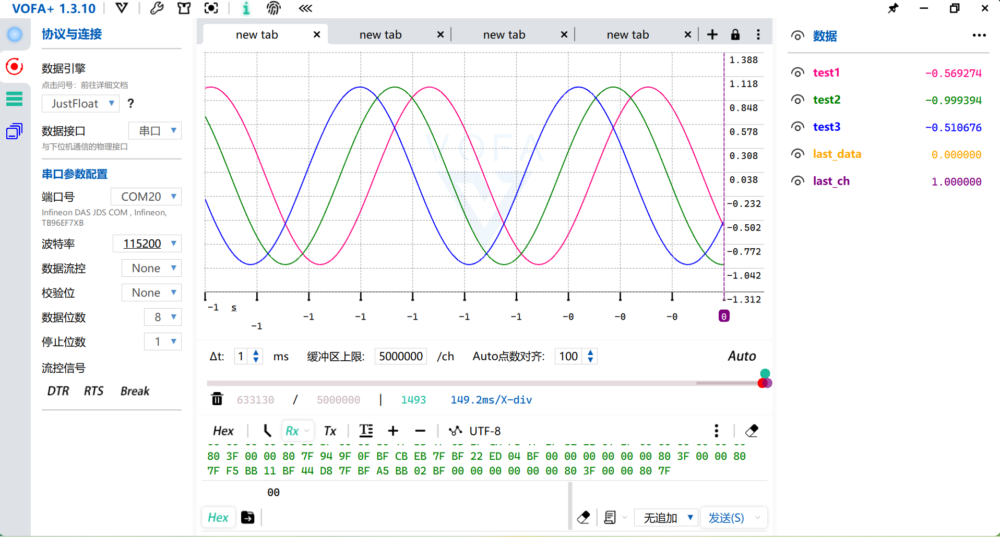
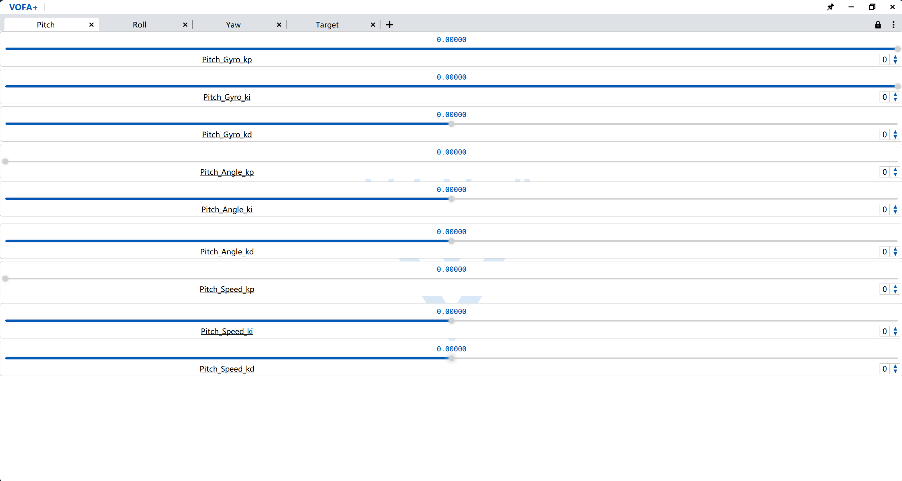
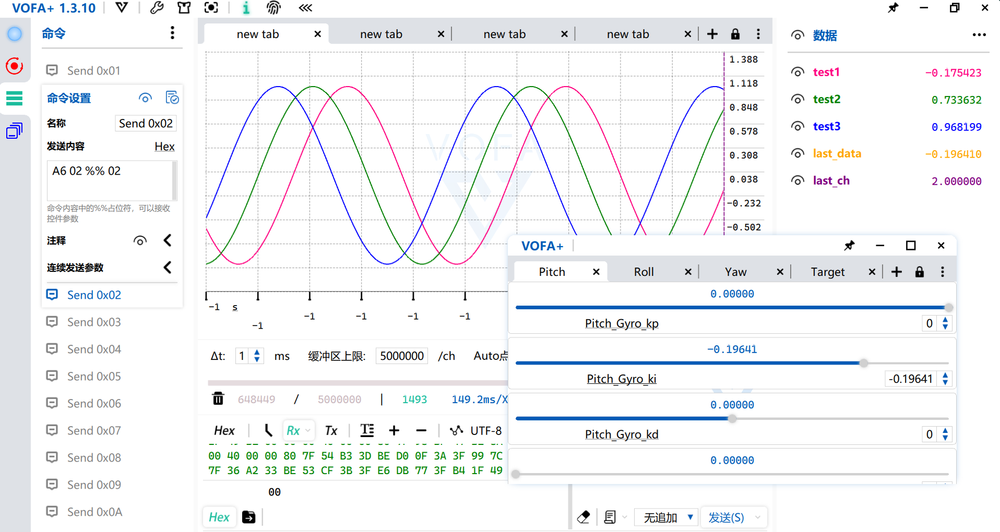

# VOFA+ Slave Client



## 简介 (Introduction)

本项目是一个为 [VOFA+](https://www.vofa.plus/) 调试助手设计的轻量级 C 语言客户端（Slave）。它允许你的嵌入式设备（如各类单片机）通过串口、WiFi 等接口方便地与 VOFA+ 上位机进行通信，实现波形显示、调试指令交互等功能。

项目代码结构清晰，易于移植，且对[逐飞科技开源库](https://gitee.com/seekfree/)提供了原生支持。同样也可以通过宏来定义仅在C标准库下使用。

## 硬件支持与兼容性 (Hardware Support & Compatibility)

*   **测试环境**：本项目在 **逐飞 TC264 开源库** 环境下进行测试。
*   **测试硬件**：英飞凌 (Infineon) **TC264** 芯片。
*   **兼容性**：理论上，在**改动少量或不改动代码**的情况下，本项目可兼容逐飞库支持的其他芯片型号。
*   **免责声明**：由于作者手头缺乏相关硬件，**无线串口** (Wireless UART) 和 **WiFi 串口** (WiFi UART) 两种通信模式**未经实机测试**。该部分代码是按照逐飞科技提供的例程编写的。如果您在使用这两种模式时遇到 Bug，欢迎提交 Issue 反馈，共同完善项目。

## 功能特点 (Features)

*   **多接口支持**：内置支持普通串口 (UART)、WiFi SPI (TCP Client)、无线串口等多种通信方式，并预留了自定义接口。
*   **协议支持**：完美适配 VOFA+ 的 **JustFloat** 协议，支持多通道浮点数波形传输。
*   **大小端处理**：自动检测大小端，确保数据传输正确。
*   **配置灵活**：通过宏定义即可配置通道数量、缓冲区大小、通信参数等。
*   **图像传输**：支持以 JustFloat 协议发送图像数据 (`VOFA_Send_JustFloat_Image`)。
*   **接收解析**：内置接收解析状态机，支持多通道 (最高255个) 数据接收。

## 效果展示 (Screenshots)

### 调参滑块 (Parameter Tuning)


### 调参回传 (Loopback Test)


## 目录结构 (File Structure)

*   `LICENSE.txt`: 许可证文件 (GPL-3.0)
*   `README.md`: 项目说明文档
*   `img/`: 项目演示图片
    *   ...
*   [**`examples/`**](examples): **VOFA+ 上位机配置示例 (VOFA+ 的配置文件在这边)**
    *   `tabs.tabview.json`: 界面布局模板
    *   `vofa+.cmds.json`: 命令定义模板
    *   `README.md`: 示例使用说明
*   `src/`: 核心源代码
    *   `vofa_client.c`: 客户端实现文件
    *   `vofa_client.h`: 客户端头文件

## 如何使用 (Usage)

### 1. 将文件加入项目

将 `src` 目录下的 `vofa_client.c` 和 `vofa_client.h` 复制到你的工程目录中，并在你的 IDE 或 Makefile 中添加这两个文件。

### 2. 配置参数

打开 `vofa_client.h`，根据你的硬件环境修改配置宏：

*   **通道数配置**：
    ```c
    #define VOFA_RECV_CH_NUM  (64)  // 接收通道数 最高255
    #define VOFA_SEND_CH_NUM  (32)  // 发送通道数
    ```
*   **依赖库配置**：
    如果你使用的是逐飞库，保留 `#define USE_ZF_LIBRARY`。否则请注释掉，并需要在 `.c` 文件中补充自定义底层的发送/接收实现。
*   **通信接口配置**：
    修改 `#define VOFA_CLIENT_COM_INTERFACE` 选择通信方式（0:串口, 1:WiFi SPI, etc.）。
    并根据选择的接口配置相应的引脚、波特率或 IP/端口信息。

### 3. 初始化

在主程序初始化阶段调用 `VOFA_Client_Init()`：

```c
#include "vofa_client.h"

int main(void)
{
    // 系统初始化...
    
    // VOFA 客户端初始化
    if(VOFA_Client_Init())
    {
        // 初始化成功
    }
    else
    {
        // 初始化失败处理
    }
    
    while(1)
    {
        // 你的主循环
    }
}
```

### 4. 数据接收

你需要周期性地或者在接收中断中调用 `VOFA_Receiver_Callback()` 来处理接收到的数据。

```c
// 方式一：在主循环中轮询（适用于查询方式）
while(1)
{
    VOFA_Receiver_Callback();
    // ... 其他代码
}

// 方式二：在串口接收中断中调用
void UART_IRQHandler(void)
{
    // ... 
    VOFA_Receiver_Callback();
    // ...
}
```

### 5. 数据发送 (波形显示)

使用 `VOFA_Set_Float_Data` 设置通道数据，最后调用 `VOFA_Send_Datas` 一次性发送。

```c
float temp = 25.5;
float humi = 60.2;

// 设置通道 0 的数据
VOFA_Set_Float_Data(0, temp);
// 设置通道 1 的数据
VOFA_Set_Float_Data(1, humi);

// 发送前 2 个通道的数据到上位机
VOFA_Send_Datas(2);
```

或者使用变长参数函数：

```c
// 设置并发送前 2 个通道的数据
VOFA_Set_Float_Datas_From_Start(2, temp, humi);
VOFA_Send_Datas(2);
```

### 6. 接收数据的使用

接收到的数据存储在全局变量 `vofa_rev_data[]` 中，你可以直接读取，或者通过 `vofa_rev_new_data_flag[]` 判断是否有新数据更新。

## 协议说明 (License)

本项目采用 **GNU General Public License v3.0 (GPL-3.0)** 许可证。
详情请参阅 [LICENSE.txt](LICENSE.txt) 文件。
