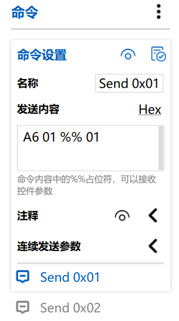

# VOFA+ 上位机配置示例

本目录包含适配 `vofa_client` 驱动的 VOFA+ 上位机配置文件。这些文件可以帮助你快速搭建调试界面，实现数据波形显示和指令交互。

## 文件说明

*   **`tabs.tabview.json`**: VOFA+ 的界面布局文件（Tab View）。包含了拖动条、按钮控件等的布局和配置。
*   **`vofa+.cmds.json`**: VOFA+ 的命令定义文件。定义了上位机可以通过按钮或快捷键发送给下位机的指令格式。

## 使用方法

### 1. 安装 VOFA+

请前往 [VOFA+ 官网](https://www.vofa.plus/) 下载并安装最新版本的 VOFA+ 调试助手。

### 2. 导入界面布局 (`tabs.tabview.json`)

1.  打开 VOFA+ 软件。
2.  在软件主界面，更多操作选择**载入** `tabs.tabview.json` 文件。
3.  导入成功后，你应该能看到配置好的交互面板。

### 3. 导入命令定义 (`vofa+.cmds.json`)

1.  在 VOFA+ 界面右侧的 "命令" 选项卡区域。
2.  点击右上角三点，选择 "载入" 。
3.  选择 `vofa+.cmds.json` 文件。
4.  导入后，你将在命令列表中看到预定义的调试指令。
### 4. 命令格式与绑定

本示例使用的命令格式为 **Hex**（十六进制），基本结构为 `A6 XX %% XX`。

*   **`A6`**: **帧头**。这是下位机解析数据的识别标志，必须固定。
*   **`XX`**: **通道号**（例如 `01`）。代表这是给第 1 个参数通道发送的数据。
*   **`%%`**: **浮点数占位符**。VOFA+ 会自动将滑动条或输入框中的浮点数值替换到这里（以 4 字节 Hex 形式）。
*   **`XX`**: **校验/确认通道号**。为了防止传输错误导致修改了错误的参数，再次发送一次通道号进行校验。

**示例**：
若要设置第 1 个通道（通道号 01），命令应选择`Hex`并写为：`A6 01 %% 01`。

> **注意**：如果你在界面上新增了滑动条或按钮等**调参控件**，请务必在控件属性中**绑定对应的命令**，否则控件操作将不会发送任何数据。
## 协议配置说明

为了配合本驱动代码 (`src/vofa_client.c`) 正常工作，请确保 VOFA+ 的连接配置如下：

*   **协议 (Protocol)**: 选择 **JustFloat**。
    *   本驱动代码默认使用 JustFloat 协议发送数据（以 `00 00 80 7f` 结尾）。
*   **接口 (Interface)**: 根据你的硬件连接选择。
    *   如果是串口连接，选择 Serial，并设置正确的波特率（默认代码中为 115200）。
    *   如果是 WiFi 连接，选择 TCP服务端，并填写相应的端口。

## 常见问题

*   **没有波形显示？**
    *   请检查波特率是否匹配。
    *   请确认 VOFA+ 中协议是否选择了 `JustFloat`。
    *   请确认代码中 `VOFA_Send_Datas()` 是否被周期性调用。
*   **指令发送无反应？**
    *   请检查命令绑定的数据格式是否与下位机接收解析逻辑一致。本项目驱动中的接收逻辑主要在 `VOFA_Receiver_Callback` 函数中，帧头默认为 `0xA6`。
